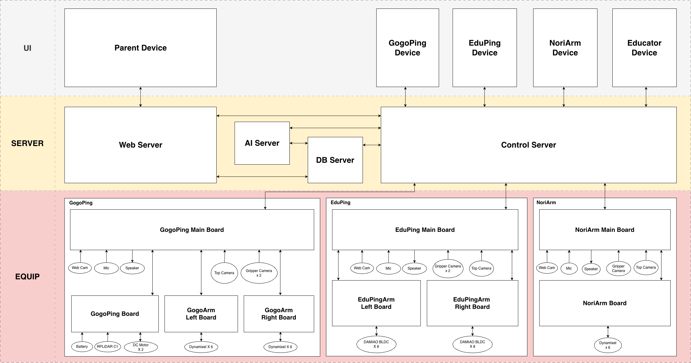
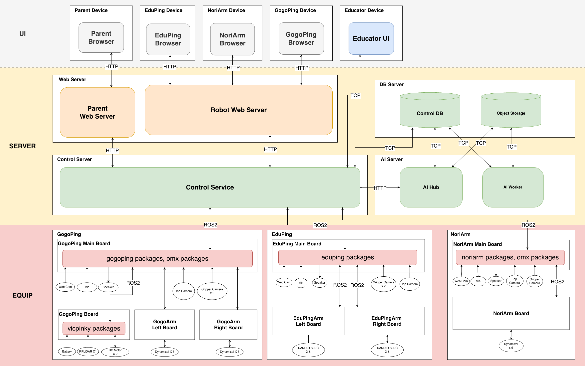

# System Architecture

## 로봇 구성

| 서비스명 | 하드웨어 |
| --- | --- |
| EduPing | OpenArm |
| GogoPing | Vic Pinky + OMX x 2 |
| NoriArm | OMX |

## Hardware Architecture

📐 **Untitled Diagram-1777461129023.drawio** — [📐 Untitled Diagram-1777461129023.drawio](system-architecture.assets/Untitled Diagram-1777461129023.drawio)

## Software Architecture

📐 **Untitled Diagram-1777624819005.drawio** — [📐 Untitled Diagram-1777624819005.drawio](system-architecture.assets/Untitled Diagram-1777624819005.drawio)
